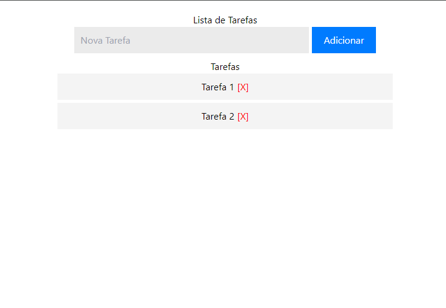

<div align="center">
  <h1>Task Manager PHP</h1>
  <p>Aplicação desenvolvida de gerenciamento de tarefas, adicionar e deleção, utilizando PHP com o fim de estudos.</p>
  
</div>

# 📒 Índice
* [Descrição](#descrição)
* [Requisitos Funcionais](#requisitos)
  * [Features](#features)
* [Tecnologias](#tecnologias)
* [Design](#design)
  * [Cores](#cores)
  * [Fontes](#fontes)
* [Instalação](#instalação)
* [Licença](#licença)

# 📃 <span id="descrição">Descrição</span>
Aplicação desenvolvida de gerenciamento de tarefas, adicionar e deleção, utilizando [**PHP**](https://www.php.net/) com o fim de estudos realizando a leitura e escrita em um arquivo TXT.

# 📌 <span id="requisitos">Requisitos Funcionais</span>
- [x] Cadastro de tarefas<br>
- [x] Listagem de tarefas<br>
- [x] Deleção de tarefas<br>

## Features
- [x] Persistência das tarefas localmente<br>

# 💻 <span id="tecnologias">Tecnologias</span>
- **HTML**
- **CSS**
- **PHP**

# 🎨 <span id="design">Design</span>
- O modelo final para versão desktop e mobile está disponível na pasta `./design`

- <span id="cores">Cores<br></span>
  * #ebebeb<br>
  * #007bff<br>
  * #fff<br>
  * #0056b3<br>
  * #f4f4f4<br>
  * #ccc<br>
  * #ff0000<br>

- <span id="fontes">Fontes<br></span>
  * Arial, sans-serif

# 🚀 <span id="instalação">Instalação</span>
```bash
  # Clone este repositório:
  $ git clone https://github.com/CleilsonAndrade/task-manager-php.git
  $ cd ./task-manager-php

  # Executar:
  $ php -S localhost:8000
```

# 📝 <span id="licença">Licença</span>
Esse projeto está sob a licença MIT. Veja o arquivo [LICENSE](LICENSE) para mais detalhes.

---

<p align="center">
  Feito com 💜 by CleilsonAndrade
</p>